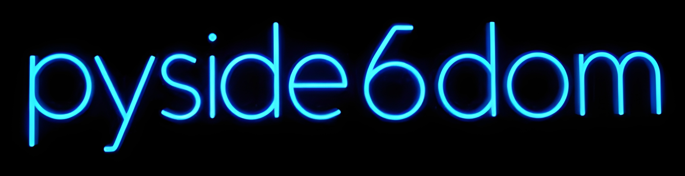

# PySide6DOM v0.5.6
**Bring the simplicity of the Web DOM to Python PySide6 Desktop Applications.**

# Installation
```bash
pip install pyside6dom
```
  

### Upgrade: 
> pip install --upgrade pyside6dom

## PySide6DOM Tutorials:
> ## [Tutorials](https://github.com/ChristopherAndrewTopalian/pyside6dom/tree/main/tutorials)

---

**PySide6DOM** bridges the gap between web development and systems programming. It wraps the raw power of the PySide6 (C++/Qt) rendering engine inside the familiar, intuitive Document Object Model (DOM) paradigm used by JavaScript and HTML.  

If you know how to build a web page using `createElement (ce)`, `getElementById (ge)`, and `append (ba)`, you already know how to build high-performance, standalone Python desktop applications.

---

### Notice how it looks very similar to JavaScript DOM scripting!

```python
# styling_text.py

from pyside6dom import *

init_window('Our App', 700, 600)

ourTitle = ce('text')
ourTitle.textContent = 'Hi Everyone'
ourTitle.style.fontFamily = 'Arial'
ourTitle.style.fontSize = '70px'
ourTitle.style.fontWeight = 'bold'
ourTitle.style.color = 'rgb(255, 255, 255)'
ba(ourTitle)

run_app()
```

---

### 🌟 Why Use PySide6DOM?

* **Zero HTML Parsing:** This is not a web view or a browser wrapper. It generates native C++/Qt desktop widgets using Python, ensuring maximum performance.
* **Familiar Syntax:** Uses lightweight helper functions modeled directly after the web DOM (`ce()` for create element, `ge()` for get element, `ba()` for body append).
* **Rapid Prototyping:** Build user interfaces in seconds without getting bogged down in complex object-oriented boilerplate.
* **Educational Bridge:** The perfect stepping stone for web developers transitioning into local hardware control, computer vision, and systems engineering.

---

### 🚀 The Code: Web Logic meets Python Power

Look how clean and intuitive building a native desktop app becomes. No complex classes, no confusing layout managers - just straightforward DOM logic.

```python
# input_upper.py

from pyside6dom import *

init_window('Our App', 700, 600)

our_greeting = ce('text')
our_greeting.textContent = 'Hi Everyone'
our_greeting.style.fontFamily = 'Arial'
our_greeting.style.fontSize = '70px'
our_greeting.style.fontWeight = 'bold'
our_greeting.style.color = 'rgb(255, 255, 255)'
ba(our_greeting)

word_input = ce('input')
word_input.placeholder = 'Enter Name'
def handle_input():
    ge('output_txt').textContent = word_input.value.upper()
word_input.oninput = handle_input
ba(word_input)

output_txt = ce('text')
output_txt.id = 'output_txt'
output_txt.textContent = 'Output'
ba(output_txt)

run_app()

```

---

## 📖 API Reference

### Core Engine Functions
* `init_window(title, width, height, icon)`: Initializes the main window and layout with icon for title bar and tray.
* `run_app()`: Starts the Qt application event loop.
* `ce(tag)`: *(`document.createElement`)* Creates a native widget wrapped as a DOMElement.
* `ge(id)`: *(`document.getElementById`)* Retrieves a previously created element by its `.id`.
* `ba(child, parent=None)`: *(`appendChild`)* Appends an element to the main window or a parent container.
* `set_theme(css)` or `set_global_style(css)`: Applies a universal CSS stylesheet to the entire application.
* `setInterval(callback, ms)`: Repeatedly runs a callback at the specified millisecond interval.
* `cl(*args)` or `console.log(*args)`: Logs output to the console, mirroring web debugging.
* Sound Implemented using .wav files  
* show_commands(): shows a list of available commands  

---

### Supported Tags & Widget Bindings
* **`text` / `p` / `h1` / `span`**: Text labels. 
  * Properties: `.textContent`, `.innerHTML`
* **`button`**: Standard push button.
  * Properties: `.textContent`, `.onclick`
* **`input`**: Single-line text input field.
  * Properties: `.value`, `.placeholder`, `.oninput`
* **`textarea`**: Multi-line text edit area.
  * Properties: `.value`, `.placeholder`, `.oninput`
* **`slider`**: Numeric range slider.
  * Properties: `.value`, `.oninput`
* **`checkbox`**: Toggle checkbox.
  * Properties: `.checked`, `.textContent`, `.oninput`
* **`select` / `dropdown`**: Dropdown selection menu.
  * Properties: `.options` (list), `.value` (selected text), `.oninput`
* **`img`**: Image display element with Aspect Ratio
  * Properties: `.src` (file path)
* **`video`**: Video display element with Aspect Ratio
* **`div`**: Standard container widget for grouping elements.
* **`scroll_div`**: Scrollable container area for overflow content.
* **`CSS keywords`**: div, text, button, scroll_div, select, option
* **`flex`**: row and column
---

### Universal Properties & Methods
*All elements support the following properties:*
* `.id`: Unique string identifier for retrieval with `ge(id)`.
* `.style("css_string")`: Inline CSS styling targeting the specific element.

We can type:  
element.style.color = 'rgb(0, 255, 255)'

---

## 🎨 CSS Styling & Tag Mapping

The engine translates standard HTML tags into PySide6 widgets behind the scenes. This allows you to write clean, web-style CSS for your desktop applications. 

*(Note: If you are already a PySide6 veteran, standard Qt class names like `QPushButton` will still work perfectly!)*

### Layout & Containers
* **`body`** ➔ `QMainWindow` (and central widget)
* **`div`** ➔ `QWidget`
* **`scroll_div`** ➔ `QScrollArea`

### Text & Media
* **`text`, `h1`, `p`, `span`, `img`** ➔ `QLabel`

### Interactive Controls
* **`button`** ➔ `QPushButton`
* **`input`** ➔ `QLineEdit`
* **`textarea`** ➔ `QPlainTextEdit`
* **`checkbox`** ➔ `QCheckBox`
* **`slider`** ➔ `QSlider`
* **`select`** (or **`dropdown`**) ➔ `QComboBox`
* **`select option`** ➔ `QComboBox QAbstractItemView` (The dropdown list items)

### CSS Properties
* **`font-color`** ➔ `color`

---

**pyside6dom Created by Christopher Andrew Topalian**

*College of Scripting Music & Science*

> *Disclaimer: This is an independent open-source educational project. "PySide" and "Qt" are registered trademarks of The Qt Company. This project is not affiliated with, endorsed by, or sponsored by The Qt Company.*

---

# Easy Example:

```python
# easy_example_with_set_theme.py

from pyside6dom import *

set_theme("""
    body {
        background-color: rgb(30, 30, 30);
    }
    button {
        background-color: rgb(0, 0, 0);
        color: cyan;
        /* we write 1px before solid */
        border: 1px solid rgb(255, 255, 255);
        border-radius: 5px;
    }
    button:hover {
        background-color: #555;
        border-color: rgb(0, 255, 255);
    }
    button:pressed {
        font-weight: bold;
    }
    input {
        border: 1px solid white;
    }
""")

init_window("Our App", 600, 400)

welcomeMessage = ce('text')
welcomeMessage.textContent = 'Welcome'
ba(welcomeMessage)

sayHiBtn = ce('button')
sayHiBtn.textContent = 'Hi'
def handle_click():
    welcomeMessage.textContent = 'Hi'
sayHiBtn.onclick = handle_click
ba(sayHiBtn)

sayHowdyBtn = ce('button')
sayHowdyBtn.textContent = 'Howdy'
def handle_click():
    welcomeMessage.textContent = 'Howdy'
sayHowdyBtn.onclick = handle_click
ba(sayHowdyBtn)

sayThisBtn = ce('button')
sayThisBtn.textContent = 'Custom'
def handle_click(message):
    welcomeMessage.textContent = message
sayThisBtn.onclick = lambda: handle_click('Hey Now')
ba(sayThisBtn)

run_app()
```

---

COMMON COMMANDS:
### Install:
> pip install pyside6dom

### Upgrade: 
> pip install --upgrade pyside6dom

---

GitHub: https://github.com/ChristopherAndrewTopalian/pyside6dom  

PyPi: https://pypi.org/project/pyside6dom/  

PyPi_Stats: https://pypistats.org/packages/pyside6dom  

---

### How to Download the GitHub Repository
1. Click the green Code Button on the GitHub page
2. Choose Download ZIP
3. Save the Zip File
4. Extract All

---

Hapy Scripting :-)

---

//----//

// Dedicated to God the Father  

// Copyright (c) 2026-present Christopher Andrew Topalian  
   
// Apache License
   Version 2.0, January 2004
   http://www.apache.org/licenses/  

// GitHub: https://github.com/ChristopherAndrewTopalian/pyside6dom

// PyPI: https://pypi.org/project/pyside6dom/

// https://github.com/ChristopherAndrewTopalian  

// https://github.com/ChristopherTopalian  

// https://sites.google.com/view/CollegeOfScripting

